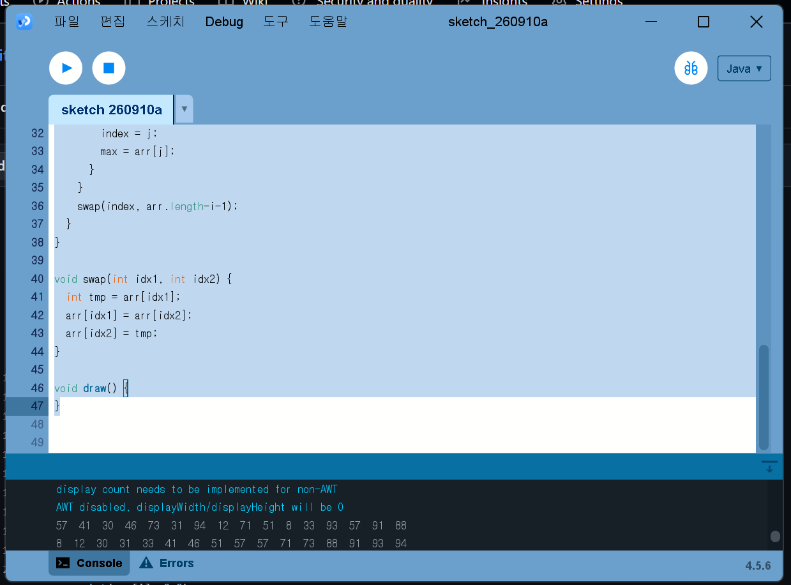
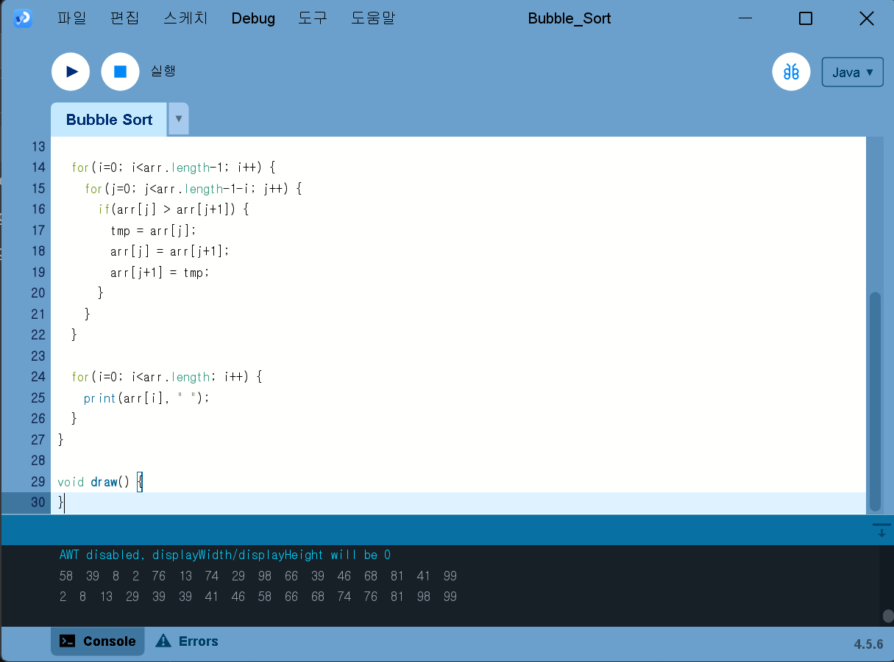
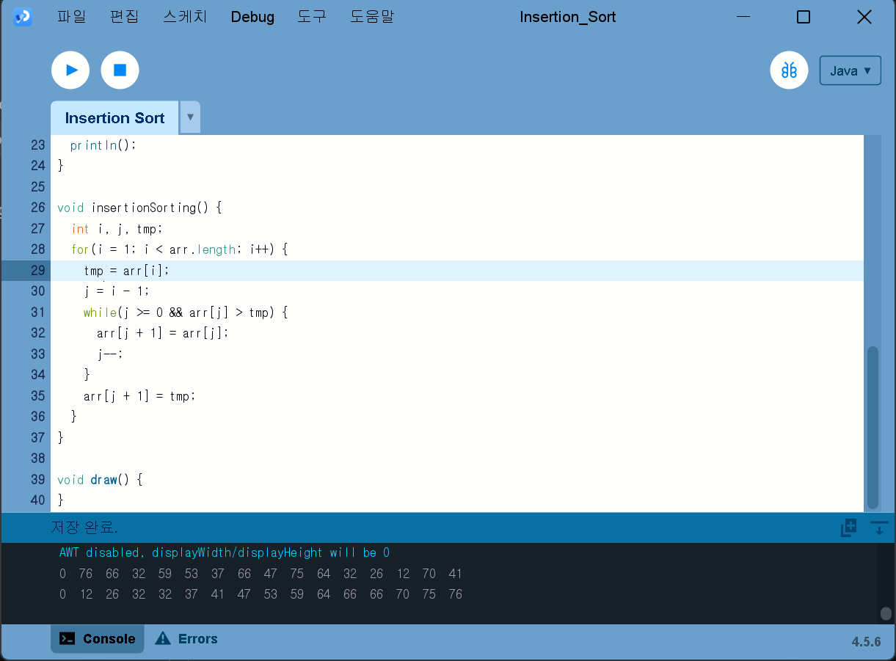
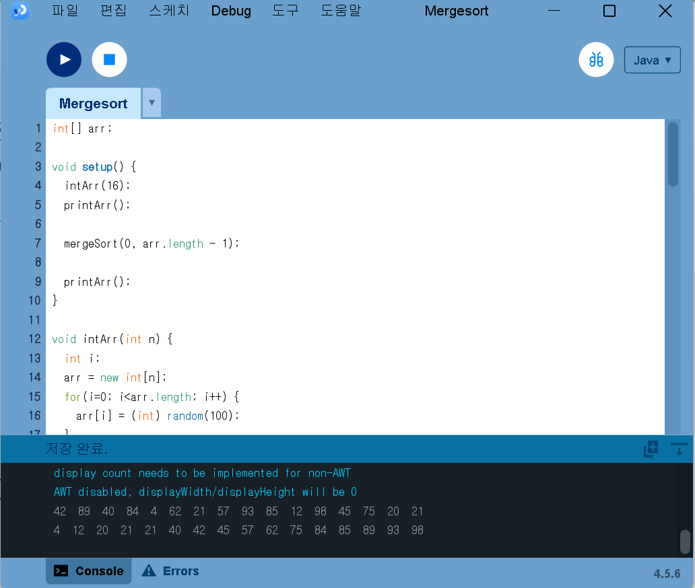
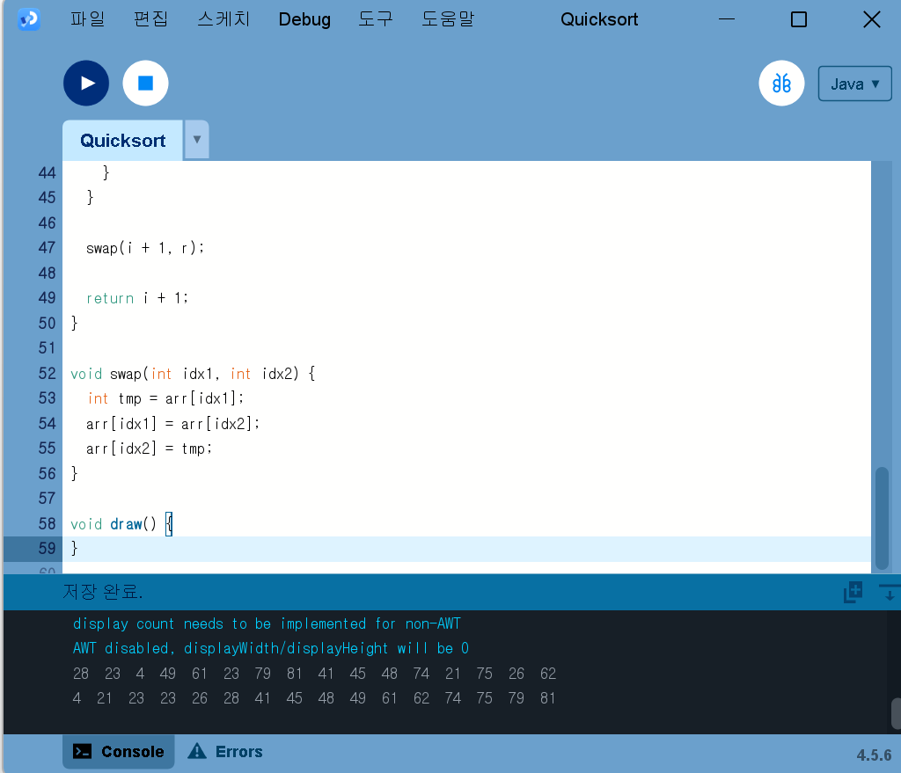
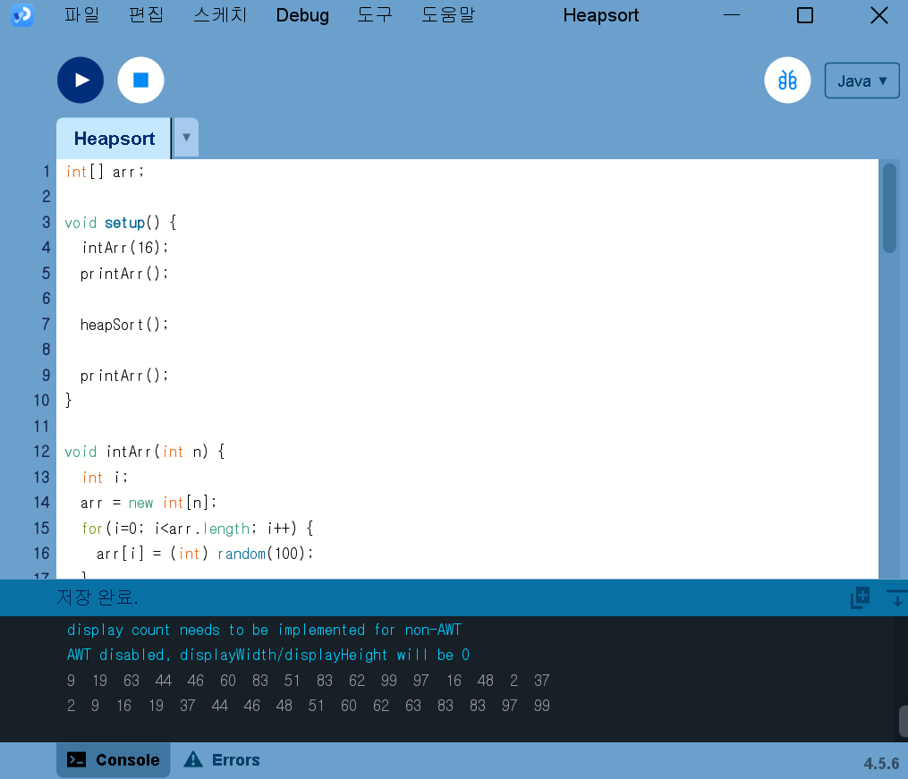
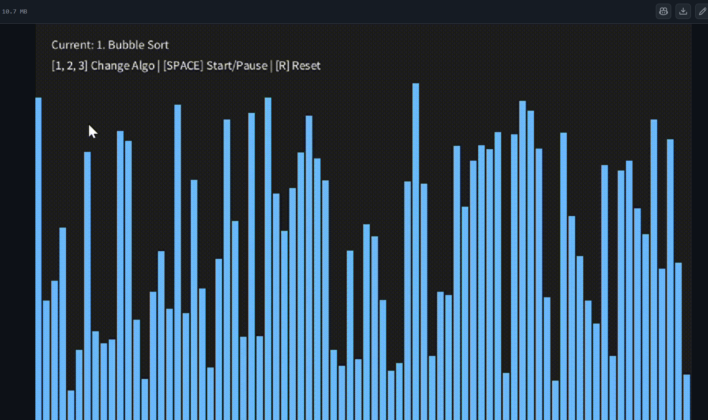
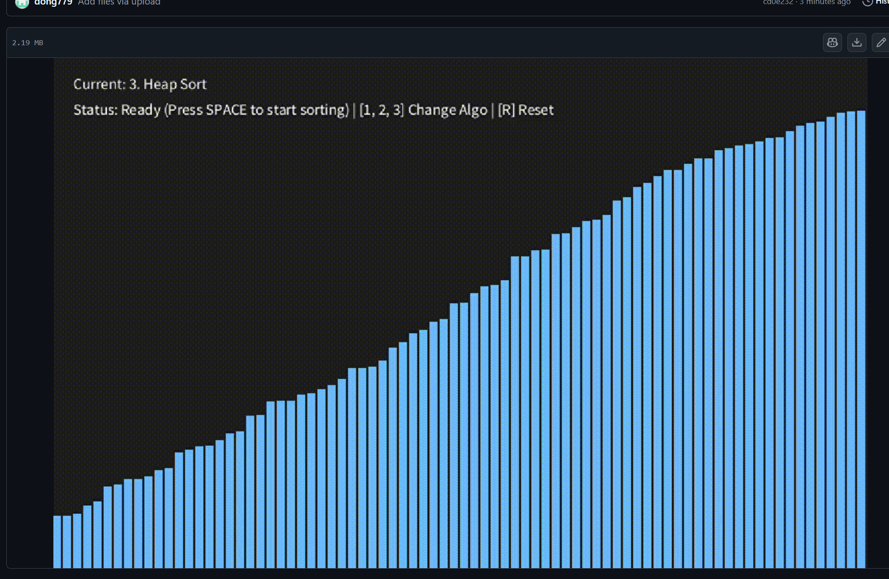

# Algorithm2026
### Homework1

[SelectionSorting](./Homework/SelectionSorting.pde)

[Bubble_Sort](./Homework/Bubble_Sort.pde)

[Insertion_Sort](./Homework/Insertion_Sort.pde)

[Mergesort](./Homework/Mergesort.pde)

[Quicksort](./Homework/Quicksort.pde)

[Heapsort](./Homework/Heapsort.pde)

### Homework2

[SortAnimation(Selection/Bubble/Insertion)](./Homework/SortAnimation1.gif)

[SortAnimation_code(Selection/Bubble/Insertion)](./Homework/SortAnimation1.pde)

[SortAnimation(Merge/Quick/Heap)](./Homework/SortAnimation2.gif)

[SortAnimation_code(Merge/Quick/Heap)](./Homework/SortAnimation2.pde)
